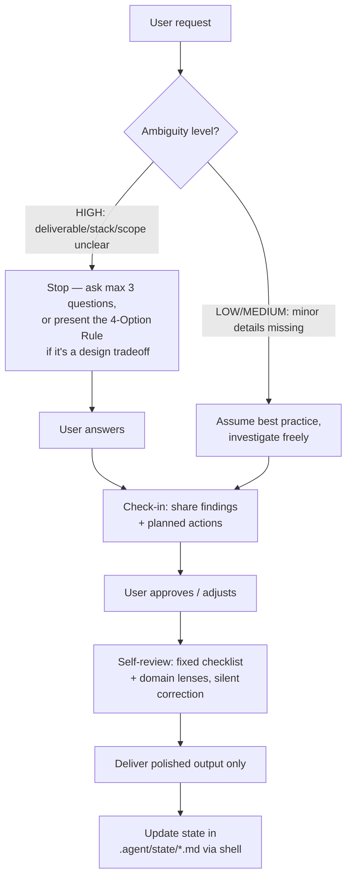

# 🧠 Autocritic-Skill — AI Self-Review, Check-In & State Persistence Protocol

> [!NOTE]
> This project implements a high-level behavioral guideline and a shell-based state synchronization protocol for terminal-based AI Agents (such as Claude Code, Gemini CLI, Codex, Aider, etc.). It prevents unverified modifications, silences fake verification theater, and forces the agent to review its own output before delivering it.

---

## 💎 What is Autocritic-Skill?

**Autocritic-Skill** redefines how AI assistants behave during software development. Instead of acting in a purely "helpful" manner — which often leads to guesswork, unchecked modifications, and unverified boilerplate — this protocol makes the agent behave like a collaborative partner: it investigates freely, asks only when the ambiguity is real, always shares its plan before touching anything, and silently reviews its own draft against a fixed checklist before delivering it. Operational state is persisted directly inside your repository so context survives terminal session restarts.



---

## 🌟 Key Features

| Feature | Description | Key Benefit |
| :--- | :--- | :--- |
| **Adaptive Ambiguity Routing** | HIGH ambiguity (unclear deliverable, stack, or conflicting constraints) stops the agent to ask up to 3 questions. LOW/MEDIUM ambiguity is resolved with industry best practice, no question asked. | Eliminates both reckless guessing and pointless clarifying questions. |
| **Check-In Before Acting** | After investigating, the agent shares what it found and what it plans to do — and waits for your response — before modifying anything. | You catch dependencies and context the agent may have missed, before any change lands. |
| **Invisible Self-Review** | Before delivering, the agent re-reads its own draft against a fixed checklist and domain-specific lenses (code / text / architecture), correcting silently. The checklist is mandatory — a plain "looks fine" pass doesn't count as a review. | Catches logical gaps, unjustified claims, and scope drift before you ever see them. |
| **No Fake Testing** | The agent never appends `assert`/`console.log` blocks or "if you run this..." simulations to *prove* its own output works — that's theater, not verification. | No wasted tokens on demonstrations that verify nothing. |
| **The 4-Option Rule** | When ambiguity is HIGH *and* it's a genuine design tradeoff (not just a missing fact), the agent presents exactly 4 distinct paths, one marked as recommended. | You keep full control over architectural decisions with a clear default. |
| **Layer Priority Under Constraints** | If a model can't sustain every behavior at once, it degrades in a fixed order — check-in before acting is never dropped; state persistence is dropped first. | Predictable degradation instead of random behavior loss on weaker models. |
| **Shell-Based State Persistence** | Operational state (`context.md`, `decisions.md`, `uncertainties.md`) is persisted to local Markdown files via plain shell redirection — no external scripts. Logs rotate at ~200 lines to an archive file. | Persistent, auditable context across terminal session restarts, without unbounded log growth. |

---

## 📂 Package Directory Structure (`autocritic-skill/`)

Everything required for the agent to operate is unified inside this single isolated folder:

*   `SKILL.md` — The core instruction set: ambiguity routing, check-in protocol, self-review mechanism, state persistence, and layer priority.
*   `README.md` — This quickstart guide.
*   `references/model-behavior.md` — How Claude, Gemini, and GPT-4 each interpret the instructions differently, and why the skill holds across all three.
*   `references/design-rationale.md` — Why invisible review beats verbalized critique, why ambiguity routing beats "always ask," edge cases and limitations, and the detailed domain-lens checklists.
*   `.agent/state/context.md` — Tracks the active phase (Research, Strategy, Execution, Validation) and current status. Overwritten each phase transition — not a log.
*   `.agent/state/decisions.md` — Chronological table logging all user choices and autonomous assumptions, with rationale. Also where substantive self-review corrections are logged for auditability.
*   `.agent/state/uncertainties.md` — Queue of open questions deferred under LOW/MEDIUM ambiguity, in case they need revisiting later.

> [!TIP]
> If your project already uses a state convention such as `.specify/` or `.cursor/`, the agent will use that instead of creating `.agent/state/` — check for an existing convention before assuming the default path.

---

## ⚡ How it Works & Quickstart

### 1. Copy to your Project
Simply copy this `autocritic-skill` directory to the root of any repository:
```bash
cp -r /path/to/autocritic-skill /your-project/
```

### 2. Activation
When starting a terminal session with an AI agent, it will automatically load `SKILL.md`. To guarantee activation, you can explicitly prompt:
> *"Please load and strictly follow the behavioral rules and state persistence protocols in `autocritic-skill/SKILL.md`."*

### 3. Example Execution Flow — High Ambiguity

If a user submits an ambiguous request like *"Create a database"*, the agent stops and responds with the 4-Option Rule, since this is a genuine design tradeoff:

```text
I need clarification on the following before proceeding:
- What kind of data will it store, and roughly what scale?
- Any existing infrastructure or hosting constraint?

Option A (Recommended): SQLite for quick local development — zero setup, fine until you need concurrent writes.
Option B: PostgreSQL in Docker — production-grade, more setup upfront.
Option C: MongoDB — fits well if the data is document-shaped rather than relational.
Option D: Supabase via REST API — managed Postgres with less ops overhead.

How would you like to proceed?
```

### 4. Example Execution Flow — Low Ambiguity + Check-In

For a well-scoped request like *"the drag isn't working on the top bar"*, the agent investigates on its own, then checks in before touching any file:

```text
I found that topBar is missing reactive: true, and makeDraggable
isn't passed to EmojiView — so drag only works on the main bar.

I plan to:
1. Add reactive: true to topBar
2. Pass makeDraggable when instantiating EmojiView

What do you think?
```

Once you approve, the agent makes the change, silently self-reviews it against the checklist, and only then logs the decision:

```bash
# Background command executed by the agent
cat << 'EOF' >> autocritic-skill/.agent/state/decisions.md
| 2026-07-17T10:00:00-03:00 | Drag fix | topBar reactive + makeDraggable passthrough | User-approved bug fix |
EOF
```